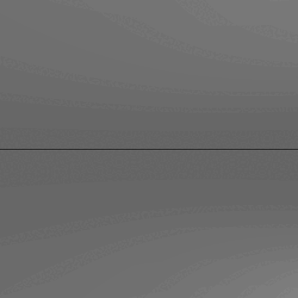

# ☠️ C++ Raytracer Animation — Planes and Spheres ☠️

This project implements a basic raytracer in C++ that renders a 3D scene containing reflective spheres and infinite planes. The scene is animated over 45 frames and output as `.ppm` images, which can be compiled into a `.gif` animation.

## 🖤 Features 🖤

-  Ray-sphere and ray-plane intersection
-  Phong lighting model with ambient, diffuse, and specular components
-  Shadow casting with occlusion
-  Reflective surfaces with recursive ray tracing
-  Multiple light types: ambient, point, and directional
-  Animated motion of spheres across frames
-  Infinite floor and ceiling using planes
-  Output images in PPM format 

## 🕸️ Scene Description 🕸️

The animation includes:
- A **purple** and **blue-grey** sphere that move toward each other, pass through the center, and reverse.
- A **white-gray reflective floor and ceiling** built using large planes.
- Multiple light sources illuminating the scene realistically with reflections and shadows.

All rendering is done via ray tracing using low-level vector math and lighting equations.

## ⚰️ Files ⚰️

- `main.cpp` – the full raytracer implementation
- `frame0.ppm` to `frame44.ppm` – rendered image frames
- `animation.gif` – final animation output (optional)
- `README.md` – this documentation

## 🩸 How to Run 🩸

# 1. Compile the raytracer
g++ -o raytracer main.cpp

# 2. Run the program to generate frames
./raytracer

# 3. Create a looping GIF (optional) (requires ImageMagick)
magick frame*.png -delay 5 -loop 0 animation.gif

# (Optional) Convert PPM frames to PNG (requires ImageMagick)
magick frame*.ppm frame%d.png

## 🔮 Final Animation Preview 🔮

